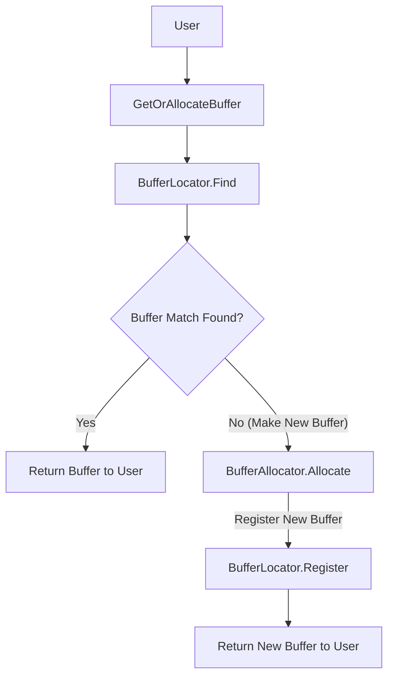

# Buffers Specification

!!! note "Version 1.0.0 (Library Version 3.0.0+)"

!!! info "`Reloaded.Memory.Buffers` is a library for allocating memory between a given minimum and maximum memory address"

With the following properties:  

- ***Memory Efficient***: No wasted memory.  
- ***Shared***: Can be found and read/written to by multiple processes.    
- ***Static***: Allocated data never moves, or is overwritten.  
- ***Permanent***: Allocated data lasts the lifetime of the process.  
- ***Concurrent***: Multiple users can access at the same time.  

## Use Cases

!!! tip "These are just examples."

- ***Hooks***: Hooking libraries like [Reloaded.Hooks](https://github.com/Reloaded-Project/Reloaded.Hooks) can reduce amount of bytes stolen from functions.  
- ***Libraries***: Libraries like [Reloaded.Assembler](https://github.com/Reloaded-Project/Reloaded.Assembler) require memory be allocated in first 2GB.  

And some other useful functionality.

## Field Sizes

Field sizes used used in this spec are based on Rust notation; with some custom types e.g.

- `u8`: Unsigned 8 bits.
- `i8`: Signed 8 bits.
- `u4`: 4 bits.
- `u32/u64`: 4 Bytes or 8 Bytes (depending on variant).

Assume any bit packed values are sequential, i.e. if `u4` then `u4` is specified, first `u4` is the upper 4 bits.

All packed fields are `little-endian`; and written out when total number of bits aligns with a power of 2.

- `u6` + `u12` is 2 bytes `little-endian`
- `u15` + `u17` is 4 bytes `little-endian`
- `u26` + `u22` + `u16` is 8 bytes `little-endian`
- `u6` + `u11` + `u17` ***is 4 bytes*** `little-endian`, ***not 2+2***

## General Access Pattern

!!! note "Names below are not final API, only for illustration purposes."

In the flowchart above, the user calls `GetOrAllocateBuffer`, which in turn calls `BufferLocator.Find` to check if 
any matching buffer exists. 

If a match is found (Yes path), the buffer is returned to the user. 

If no match is found (No path), `BufferAllocator.Allocate` is called, which then calls `BufferLocator.Register` to register the 
new buffer, and then the new buffer is returned to the user.